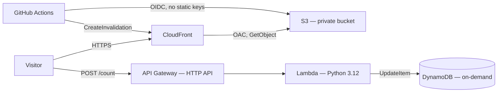

# Cloud Resume Challenge — AWS

A serverless personal resume site with a live visitor counter, built to the [Cloud Resume Challenge](https://cloudresumechallenge.dev/docs/the-challenge/aws/) spec: static frontend on S3/CloudFront, a Python Lambda + DynamoDB backend behind API Gateway, all provisioned as Terraform, deployed through GitHub Actions using OIDC — no long-lived AWS credentials anywhere.

**Live site:** [https://d1ls75i2eksje9.cloudfront.net](https://d1ls75i2eksje9.cloudfront.net)


---

## Architecture



The static site (S3 + CloudFront) and the counter API (API Gateway + Lambda + DynamoDB) are independent — the site works even if the counter API is down, it just shows "unavailable."

## Tech stack

| Layer | Choice | Why |
|---|---|---|
| Static hosting | S3 (private) + CloudFront, Origin Access Control | Private bucket, no public S3 URL, HTTPS + CDN caching for free |
| API | API Gateway HTTP API | Cheaper and simpler than REST API for a single Lambda-proxy route |
| Compute | Lambda, Python 3.12 | Pay-per-invocation, no idle server for a low-traffic personal site |
| Data | DynamoDB, on-demand capacity | Traffic is unpredictable and low-volume; no capacity to provision or guess |
| IaC | Terraform | Reviewable, reproducible infra; no manual console drift |
| CI/CD | GitHub Actions + OIDC federation | Short-lived, per-run AWS credentials — nothing stored in GitHub secrets |

## Repo structure

```
cloud-resume-challenge/
├── .github/workflows/
│   └── frontend.yml       # syncs site/ to S3 and invalidates CloudFront on push
├── infra/                 # all Terraform
│   ├── versions.tf        # Terraform + provider version pins
│   ├── providers.tf       # AWS provider config, default tags
│   ├── variables.tf
│   ├── dynamodb.tf        # visitor counter table
│   ├── iam.tf             # Lambda execution role + least-privilege policy
│   ├── lambda.tf          # function resource, packaging
│   ├── lambda/
│   │   └── counter.py     # Lambda source
│   ├── api_gateway.tf     # HTTP API, route, CORS
│   ├── s3.tf              # private site bucket + policy
│   ├── cloudfront.tf      # distribution + Origin Access Control
│   ├── github_oidc.tf     # GitHub Actions OIDC provider + deploy role
│   └── outputs.tf
├── site/                  # the resume itself
│   ├── index.html
│   ├── style.css
│   └── script.js
└── .gitignore
```

## How the counter works

`script.js` sends `POST /count` on page load (a mutation, so POST — not GET, which browsers, crawlers, and preview bots can trigger unintentionally). Lambda runs a DynamoDB `UpdateItem` with an atomic `ADD`, which self-initializes the counter on the very first call — no seed value needed. CORS is enforced at API Gateway, not inside the Lambda, so it's centralized and correct for every response path, including errors.

## Security decisions

Every layer of this stack was built with least privilege as the default, not an afterthought. Full list, by layer:

**Account & local credentials**
- No long-lived root access key. Day-to-day work — including every `terraform apply` — runs as a separate IAM user, not root. Root's own access key was deleted, and MFA is enabled on the root user.

**IAM — Lambda execution role**
- The trust policy scopes `sts:AssumeRole` to exactly `lambda.amazonaws.com`. Only the Lambda service can assume this role.
- The DynamoDB permission is `dynamodb:UpdateItem` only, on this table's exact ARN — not `dynamodb:*`, not `resources = ["*"]`. A compromised function could increment a counter and nothing else in the account.
- Logging permission uses AWS's managed `AWSLambdaBasicExecutionRole` policy instead of a hand-written one, so it grants exactly the standard logging actions and no more.

**Data — DynamoDB**
- `lifecycle { prevent_destroy = true }`. The table holds the only real state in the stack; this makes Terraform refuse to destroy or replace it, even from a bad `apply` or an accidental `destroy`.
- Point-in-time recovery is enabled — continuous backups in case a bad deploy or bug corrupts the counter.

**API — API Gateway + Lambda**
- `aws_lambda_permission` scopes the invoke grant to this specific API's `execution_arn/*/*` — only this API Gateway can invoke the function, not API Gateway in general.
- The route exposes exactly one method on one path (`POST /count`). No unused surface area.
- POST, not GET, for the increment. GET is meant to be side-effect-free, so crawlers, link-preview bots, and browser prefetching can all silently trigger a GET endpoint; POST means only an explicit `fetch` call from the frontend does.
- CORS is enforced centrally at API Gateway (`allow_origins` scoped to the exact CloudFront domain, `allow_methods` limited to `POST`), not duplicated by hand in every Lambda return path — so it can't be forgotten on an error branch.
- CORS is a browser-enforced convenience, not access control. The API has no auth layer, since a public visitor counter has nothing to protect beyond casual abuse — stated explicitly here rather than implied.

**Storage & CDN — S3 + CloudFront**
- The bucket is fully private: `block_public_acls = true`, and ACLs are disabled entirely via `BucketOwnerEnforced`, so the bucket policy is the single source of truth for access — no ACL/policy drift to reason about.
- CloudFront reaches S3 through Origin Access Control (OAC), the current AWS-recommended mechanism, not the legacy Origin Access Identity.
- The bucket policy's `condition { AWS:SourceArn = <this distribution's ARN> }` scopes read access to this one CloudFront distribution. Without it, the principal `cloudfront.amazonaws.com` would mean *any* CloudFront distribution in *any* AWS account.
- Bucket versioning is enabled, so an accidental overwrite or delete of a site file is recoverable.
- `viewer_protocol_policy = "redirect-to-https"` forces every visitor connection to HTTPS, even if they type `http://`.

**CI/CD — GitHub Actions → AWS**
- No static AWS access keys stored anywhere in GitHub. Authentication is OIDC federation: GitHub mints a short-lived signed token per workflow run, AWS verifies it against a registered identity provider, and hands back credentials that expire in about an hour.
- The OIDC provider's `client_id_list` restricts the token's audience to `sts.amazonaws.com`, so a token minted for some other purpose can't be replayed here.
- The deploy role's trust policy conditions on the token's `sub` claim matching this exact repo and the `main` branch (`StringEquals`, not a wildcard) — no other repo, fork, or branch can assume it.
- The deploy role's permissions are scoped to exactly one S3 bucket (list/put/delete) and one CloudFront distribution (invalidate). It cannot touch DynamoDB, IAM, Lambda, or anything else in the account.
- The workflow's `permissions:` block is minimized to `id-token: write` and `contents: read` — it can't push, open issues, or use any other part of GitHub's default token.
- `main` requires a pull request before merge. Since the trust policy trusts anything landing on `main`, branch protection is what actually enforces review before a deploy can happen.
- `concurrency` prevents two overlapping deploys from racing an `aws s3 sync --delete` against each other and leaving the bucket half-updated.

**Known trade-off, not yet closed:** GitHub Actions are pinned to floating major-version tags (`@v6`) rather than a commit SHA, so a compromised upstream action could run with this role's permissions on the next trigger. Pinning to a SHA closes that gap at the cost of manually bumping versions.

## CI/CD

**Frontend pipeline** (`frontend.yml`) — triggers on push to `main` when anything under `site/` changes. Syncs `site/` to S3 and invalidates the CloudFront cache. Runs in seconds; no manual upload step exists.

**Infra pipeline** — not yet added. Planned: `terraform plan` on every pull request touching `infra/`, posted as a PR comment; `terraform apply` only after merge to `main`, gated behind manual approval. Requires migrating from local to remote Terraform state first, since GitHub-hosted runners have no access to a state file sitting on a laptop.

